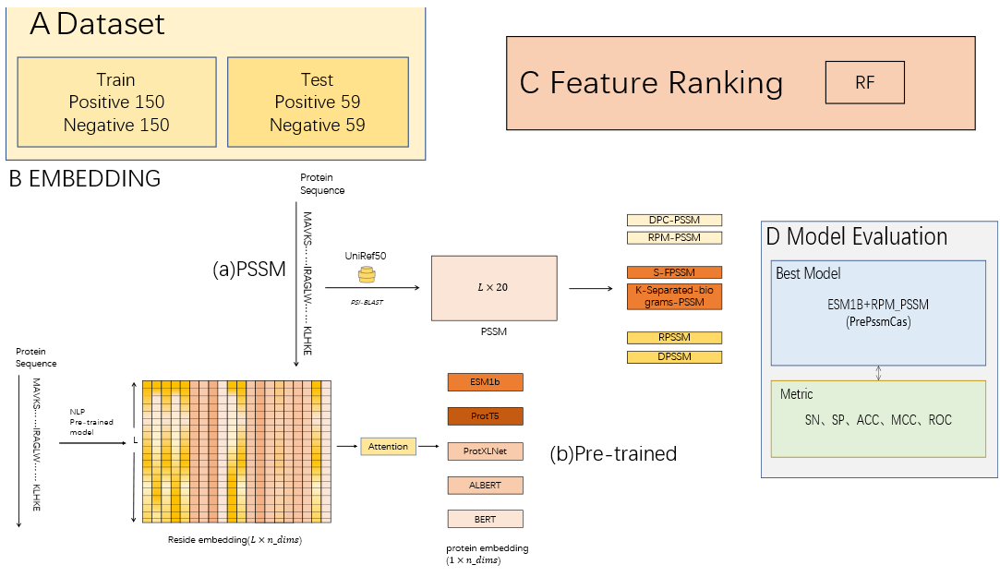

### PrePSSMCas: fusing pre-trained features and PSSM features for Cas protein classification
#### Abstract: 
Clustered regularly interspaced short palindromic repeats (CRISPR) and their associated (Cas) proteins play a vital role in prokaryotic adaptive immune systems, defending against for-eign material. However, classifying CRISPR-Cas systems can be challenging due to limited direct identification techniques. Distinct classes of Cas proteins perform different roles, offering an opportunity for classification based on their identification. This study focuses on efficiently identifying specific Cas proteins to classify CRISPR-Cas systems. To enhance Cas protein dis-tinction, two types of features were extracted from protein sequences: pre-trained model-based features and fixed-dimensional features from the PSSM matrix. These features provide compre-hensive sequence and biological information, facilitating a thorough characterization of Cas proteins. Experimental comparisons revealed the effectiveness of integrating ESM1b pre-trained features and RPM-PSSM features to represent Cas protein features comprehensively. By em-ploying a random forest feature selector, a 143-dimensional feature vector was selected, com-prising 87-dimensional pre-training-based features and 56-dimensional RPM-PSSM-based fea-tures. The selected features exhibited superior performance compared to other methods, achieving an accuracy of 97.98% on an independent validation set, which represents a 3.21% improvement over the CRISPRCasStack method. This research contributes valuable insights into the classification of CRISPR-Cas systems by identifying specific Cas proteins.

#### framework 

#### Libraries that this project depends on

    torch 
    transformers 
    sentencepiece 
    h5py
    python
    scikit-learn
    bio-embeddings
    seaborn
    matplotlib
    numpy
    pandas

#### Introduce

In this project, the pre-training features that can be used to generate protein sequences are stored in ./feature, and you need to save the mathematical variant of PSSM in the ./feature folder, and you can start loading and training